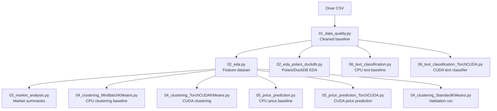

# Divar Real Estate Analysis

This project was done by Hossein Hamzehei and Mahdi Samdi Azar for the course named Data Science & AI Introductory Course with Python, conducted by the Department of Mathematical Sciences, Sharif University of Technology.

This repository provides a reproducible real estate analysis pipeline for the Divar Real Estate Ads dataset. The project is organized around executable `# %%` Python reports, compressed source data, CUDA-aware modeling alternatives, dependency-aware server execution, and a single generated artifact root under `reports/`.

## Project Structure

```text
.
├── Divar-Real-State-Ads/
│   ├── README.md
│   ├── divar_real_estate_ads.csv.zst
│   └── sampled_data.csv.zst
├── LICENSE
├── README.md
├── requirements.txt
├── scripts/
│   ├── check_environment.py
│   ├── clean_outputs.py
│   ├── compress_data.py
│   ├── export_html.py
│   └── run_pipeline.py
└── notebooks/
    ├── 01_data_quality.py
    ├── 02_eda.py
    ├── 02_eda_polars_duckdb.py
    ├── 03_market_analysis.py
    ├── 04_clustering_MiniBatchKMeans.py
    ├── 04_clustering_StandardKMeans.py
    ├── 04_clustering_TorchCUDAKMeans.py
    ├── 05_price_prediction.py
    ├── 05_price_prediction_TorchCUDA.py
    ├── 06_text_classification.py
    └── 06_text_classification_TorchCUDA.py
```

All generated project outputs are written directly under:

```text
reports/html/
reports/data/
reports/figures/
reports/models/
reports/logs/
reports/runtime_summary.csv
```

The source notebooks directory is only for executable report code. It is not used as an output directory.

## Runtime Target

Target CUDA version: `12.2`

Report-generation hardware:

| Component | Value |
| --- | --- |
| GPU | NVIDIA GeForce GTX 1080, 8GB |
| NVIDIA driver | 535.261.03 |
| CUDA | 12.2 |
| CPU | 20 threads |
| RAM | 31GB |

Modern RAPIDS/cuML is not pinned because current RAPIDS releases require newer GPU architecture than Pascal/GTX 1080. CUDA acceleration in this project is implemented with PyTorch CUDA.

## Dataset

The repository stores the dataset as maximum-compression Zstandard archives:

```text
Divar-Real-State-Ads/divar_real_estate_ads.csv.zst
Divar-Real-State-Ads/sampled_data.csv.zst
```

The main pipeline uses:

```text
Divar-Real-State-Ads/divar_real_estate_ads.csv
```

`sampled_data.csv` is retained as an auxiliary dataset archive and is not required by the main pipeline.

## Setup

Use Python 3.10 or 3.11.

```bash
git clone git@github.com:bahman-farhadian/pydsai_divar_real_estate_analysis_hossein_hamzehi_mahdi_samdi_azar.git
```

```bash
cd pydsai_divar_real_estate_analysis_hossein_hamzehi_mahdi_samdi_azar
```

```bash
python3 -m venv .venv
```

```bash
source .venv/bin/activate
```

```bash
python -m pip install --upgrade pip
```

```bash
python -m pip install -r requirements.txt
```

Validate the runtime:

```bash
python scripts/check_environment.py
```

Verify CUDA directly:

```bash
python -c "import torch; print('CUDA available:', torch.cuda.is_available()); print('CUDA device:', torch.cuda.get_device_name(0) if torch.cuda.is_available() else 'none')"
```

## Data Preparation

Decompress the main dataset before running the pipeline:

```bash
python scripts/compress_data.py decompress --input Divar-Real-State-Ads/divar_real_estate_ads.csv.zst --output Divar-Real-State-Ads/divar_real_estate_ads.csv
```

Decompress the sampled dataset only when needed:

```bash
python scripts/compress_data.py decompress --input Divar-Real-State-Ads/sampled_data.csv.zst --output Divar-Real-State-Ads/sampled_data.csv
```

Recreate compressed archives:

```bash
python scripts/compress_data.py compress --input Divar-Real-State-Ads/divar_real_estate_ads.csv --output Divar-Real-State-Ads/divar_real_estate_ads.csv.zst
```

```bash
python scripts/compress_data.py compress --input Divar-Real-State-Ads/sampled_data.csv --output Divar-Real-State-Ads/sampled_data.csv.zst
```

## Pipeline Graph



`01_data_quality.py` creates the cleaned baseline. `02_eda.py` creates the feature-enhanced dataset used by market analysis, clustering, and price prediction. Text classification can run after the cleaned baseline is available.

## Recommended Server Execution

Run the complete dependency-aware pipeline:

```bash
python scripts/run_pipeline.py --jobs 4
```

Run the complete pipeline plus full StandardKMeans validation:

```bash
python scripts/run_pipeline.py --jobs 4 --include-standard-kmeans
```

Run without CUDA alternatives:

```bash
python scripts/run_pipeline.py --jobs 4 --skip-cuda
```

The runner writes:

```text
reports/runtime_summary.csv
reports/logs/
reports/html/
reports/data/
reports/figures/
reports/models/
```

Copy the complete report bundle from a headless server with:

```bash
scp -r reports/ USER@HOST:~
```

## Individual Report Execution

Each report can also be exported directly:

```bash
python scripts/export_html.py --input notebooks/01_data_quality.py --output reports/html/01_data_quality.html
```

```bash
python scripts/export_html.py --input notebooks/02_eda.py --output reports/html/02_eda.html
```

```bash
python scripts/export_html.py --input notebooks/02_eda_polars_duckdb.py --output reports/html/02_eda_polars_duckdb.html
```

```bash
python scripts/export_html.py --input notebooks/03_market_analysis.py --output reports/html/03_market_analysis.html
```

```bash
python scripts/export_html.py --input notebooks/04_clustering_MiniBatchKMeans.py --output reports/html/04_clustering_MiniBatchKMeans.html
```

```bash
python scripts/export_html.py --input notebooks/04_clustering_TorchCUDAKMeans.py --output reports/html/04_clustering_TorchCUDAKMeans.html
```

```bash
python scripts/export_html.py --input notebooks/05_price_prediction.py --output reports/html/05_price_prediction.html
```

```bash
python scripts/export_html.py --input notebooks/05_price_prediction_TorchCUDA.py --output reports/html/05_price_prediction_TorchCUDA.html
```

```bash
python scripts/export_html.py --input notebooks/06_text_classification.py --output reports/html/06_text_classification.html
```

```bash
python scripts/export_html.py --input notebooks/06_text_classification_TorchCUDA.py --output reports/html/06_text_classification_TorchCUDA.html
```

## Analysis Stages

| Stage | File | Runtime | Purpose |
| --- | --- | --- | --- |
| Data quality | `01_data_quality.py` | CPU | Validate raw records, inspect missingness, export cleaned datasets. |
| EDA | `02_eda.py` | CPU | Create engineered features, descriptive statistics, and exploratory figures. |
| Optimized EDA | `02_eda_polars_duckdb.py` | CPU parallel | Run Polars/DuckDB aggregations and Parquet feature export. |
| Market analysis | `03_market_analysis.py` | CPU | Produce stakeholder-oriented market summaries. |
| Clustering baseline | `04_clustering_MiniBatchKMeans.py` | CPU | Fast scikit-learn market segmentation baseline. |
| Clustering validation | `04_clustering_StandardKMeans.py` | CPU | Full StandardKMeans validation report. |
| CUDA clustering | `04_clustering_TorchCUDAKMeans.py` | CUDA | GPU K-Means, CUDA PCA, CUDA silhouette sampling, CUDA projection visualization. |
| Price prediction baseline | `05_price_prediction.py` | CPU | scikit-learn tabular regression baseline. |
| CUDA price prediction | `05_price_prediction_TorchCUDA.py` | CUDA | PyTorch CUDA tabular regression model. |
| Text classification baseline | `06_text_classification.py` | CPU | TF-IDF and scikit-learn text classification baseline. |
| CUDA text classification | `06_text_classification_TorchCUDA.py` | CUDA | PyTorch CUDA embedding-bag text classifiers. |

## Output Contract

| Path | Content |
| --- | --- |
| `reports/html/` | Executed HTML reports. |
| `reports/data/` | CSV and Parquet datasets, predictions, metrics, summaries, and model reports. |
| `reports/figures/` | High-resolution generated figures. |
| `reports/models/` | Saved scikit-learn and PyTorch model artifacts plus metadata. |
| `reports/logs/` | Per-stage stdout/stderr logs from `scripts/run_pipeline.py`. |
| `reports/runtime_summary.csv` | Runtime benchmark summary generated by `scripts/run_pipeline.py`. |

Generated files are ignored by Git except HTML reports, which can be committed for final delivery:

```text
reports/data/
reports/figures/
reports/models/
reports/logs/
reports/runtime_summary.csv
*.ipynb
.ipynb_checkpoints/
```

## Runtime Benchmark

`scripts/run_pipeline.py` records runtime measurements in `reports/runtime_summary.csv`. After a full server run, use that file as the authoritative benchmark table for the generated report set.

Observed workstation checks during development:

| Stage | Runtime |
| --- | ---: |
| `01_data_quality.py` | 93.314 seconds |
| `02_eda.py` | 52.162 seconds |
| `02_eda_polars_duckdb.py` | 15.402 seconds |
| `04_clustering_TorchCUDAKMeans.py` | 30.763 seconds |

## Cleaning Generated Outputs

Preview cleanup:

```bash
python scripts/clean_outputs.py --dry-run
```

Remove generated outputs without touching `.venv`, source files, Git history, or compressed dataset archives:

```bash
python scripts/clean_outputs.py
```

Also remove expanded CSV files when a fully fresh data extraction is required:

```bash
python scripts/clean_outputs.py --include-expanded-csv
```

## License

The project code and documentation are released under the MIT License. Dataset usage is governed separately by the dataset terms documented in `Divar-Real-State-Ads/README.md`.
